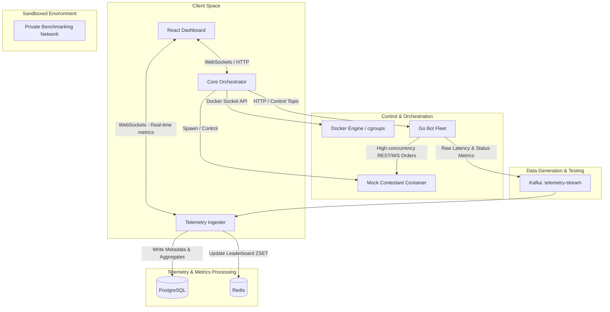

## Architecture Blueprint & System Design Document

This platform is an end-to-end distributed system designed to build, host, sandbox, stress-test, and evaluate contestant-submitted matching engines. It is designed to scale horizontally but run completely containerized on a local machine for testing and development.

---

## 1. System Architecture Diagram



---

## 2. Component Design & Responsibilities

### 2.1 Core Orchestrator (Node.js + TypeScript)
- **Code Upload & Build:** Accepts submissions (e.g., raw binaries or code zip files), writes them to disk, and uses the Docker Engine API to programmatically build a secure container image.
- **Sandboxed Hosting:** Spawns the contestant container on a dedicated, isolated Docker bridge network (`benchmarking-net`) with strict resource constraints:
  - Memory: `--memory=512m` (with swap disabled).
  - CPU: `--cpus=1` (limiting compute resource exploitation).
  - Security: Read-only root filesystem where applicable, dropping capabilities.
- **Test Orchestration:** Verifies contestant health (`/health`), triggers the Go Bot Fleet via HTTP or Kafka control payloads, monitors contestant resource consumption, and handles teardown of contestant containers when a test ends.

### 2.2 Go Bot Fleet (Go)
- **High Concurrency Traffic Generator:** Utilizes Go's lightweight goroutines and channels to simulate thousands of concurrent market participants (trading bots).
- **Execution & High-Performance Network IO:** Establishes connection pools to target the contestant container's IP/port. Bombardment includes order types:
  - `POST /order` (Limit and Market Orders)
  - `DELETE /order/:id` (Canceling Orders)
- **Telemetry Timestamping:** Captures nanosecond-precision timestamps right before writing to the network socket and immediately after reading the complete response:
  $$\Delta t = t_{\text{end}} - t_{\text{start}}$$
- **Kafka Streaming:** Ships raw JSON payloads containing metrics (`order_id`, `type`, `latency_ns`, `status_code`, `timestamp`) into the `telemetry-stream` Kafka topic.

### 2.3 Telemetry Ingester & WebSocket Server (Node.js + TypeScript)
- **Kafka Processing Pipeline:** Consumes the high-throughput `telemetry-stream` topic.
- **Metric Computation:** Tracks sliding windows of:
  - **Throughput:** Transactions per second (TPS).
  - **Latency:** p50, p90, and p99 percentiles.
  - **Correctness:** Computes error rates and ensures response format validation.
- **Persistence Layer:** Periodically inserts aggregated benchmark metrics into PostgreSQL.
- **Leaderboard Updates:** Updates the Redis Sorted Set (`leaderboard`) with a composite performance score:
  $$\text{Composite Score} = \frac{\text{TPS}}{P_{90} \text{ Latency (ms)} + 1}$$
- **Real-Time Distribution:** Exposes a WebSocket server (`ws://localhost:8001`) broadcasting real-time TPS, latency charts, and leaderboard updates to frontend clients.

### 2.4 React Frontend Dashboard (Vite + Tailwind CSS + Lucide)
- **Leaderboard:** Dynamic ranking table displaying contestant name, composite score, peak TPS, p99 latency, and success rate.
- **Live Benchmarking View:** Real-time charts (TPS fluctuations and latency histograms/timeseries) powered by a WebSocket connection to the Telemetry Ingester.
- **Control Panel:** Upload form for contestant submissions and controls to start/stop benchmarks.

---

## 3. Data Storage & Schema Design

### 3.1 PostgreSQL (Relational Storage)
Used for structured, persistent metadata like contestant registration, submission status, and historical benchmark logs.

```sql
-- Contestants table
CREATE TABLE IF NOT EXISTS contestants (
    id SERIAL PRIMARY KEY,
    team_name VARCHAR(100) UNIQUE NOT NULL,
    created_at TIMESTAMP WITH TIME ZONE DEFAULT CURRENT_TIMESTAMP
);

-- Submissions table
CREATE TABLE IF NOT EXISTS submissions (
    id SERIAL PRIMARY KEY,
    contestant_id INTEGER REFERENCES contestants(id) ON DELETE CASCADE,
    docker_image_tag VARCHAR(150) NOT NULL,
    status VARCHAR(50) DEFAULT 'pending', -- pending, building, built, failed
    build_logs TEXT,
    created_at TIMESTAMP WITH TIME ZONE DEFAULT CURRENT_TIMESTAMP
);

-- Historical Benchmark Runs
CREATE TABLE IF NOT EXISTS benchmark_runs (
    id UUID PRIMARY KEY,
    submission_id INTEGER REFERENCES submissions(id) ON DELETE CASCADE,
    status VARCHAR(50) DEFAULT 'pending', -- running, completed, failed
    total_orders_sent INTEGER DEFAULT 0,
    success_rate DOUBLE PRECISION DEFAULT 0.0,
    p50_latency_ms DOUBLE PRECISION DEFAULT 0.0,
    p90_latency_ms DOUBLE PRECISION DEFAULT 0.0,
    p99_latency_ms DOUBLE PRECISION DEFAULT 0.0,
    avg_tps DOUBLE PRECISION DEFAULT 0.0,
    started_at TIMESTAMP WITH TIME ZONE DEFAULT CURRENT_TIMESTAMP,
    ended_at TIMESTAMP WITH TIME ZONE
);
```

### 3.2 Redis (In-Memory Leaderboard)
- **Key:** `leaderboard` (Sorted Set `ZSET`)
  - **Member:** `team_name`
  - **Score:** Composite value calculated as $\text{TPS} / (P_{90}\text{ Latency (ms)} + 1)$. Using standard ZSET operations allows $O(\log N)$ inserts and instant $O(N)$ retrieval of the top rankings.
- **Key:** `run:active` (Hash)
  - Stores currently active run details (`run_id`, `team_name`, `started_at`).

---

## 4. Networking & Sandboxing Architecture

To isolate contestant containers while allowing the Go Bot Fleet to execute high-volume benchmarks, we deploy an isolated Docker network.

```
       [ Docker Host Socket ]
                 | (read/write access to orchestrator)
       [ Core Orchestrator ]
                 |
                 | (spawns container on "benchmarking-net")
                 v
   +---------------------------------------------+
   |             benchmarking-net                |
   |                                             |
   |   [ Contestant Container (e.g. 172.20.0.3) ]| (restricted by cgroups CPU/Mem)
   |        ^                                    |
   |        | REST / WebSockets                  |
   |   [ Go Bot Fleet Container ]                 |
   +---------------------------------------------+
```

Contestant containers are launched with:
- `--cpus=1` (CPU pinning / limiting concurrency amplification)
- `--memory=512m` (Strict memory limits to prevent host system crashes)
- `--network=benchmarking-net` (No route to outside internet, securing host environment from network egress)
