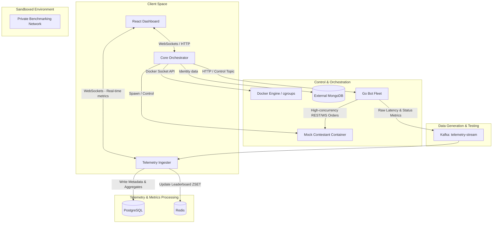

## Architecture Blueprint & System Design Document

This platform is an end-to-end distributed system designed to build, host, sandbox, stress-test, and evaluate contestant-submitted matching engines. It is designed to scale horizontally but run completely containerized on a local machine for testing and development.

---

## 1. System Architecture Diagram


```mermaid
flowchart TD
    subgraph Client Space
        FD[React Dashboard] <--> |WebSockets / HTTP| CO[Core Orchestrator]
        FD <--> |WebSockets - Real-time metrics| TI[Telemetry Ingester]
    end

    subgraph Control & Orchestration
    CO --> |Docker Socket API| CD[Docker Engine / cgroups]
    CO --> |Identity data| MG[(External MongoDB)]
        CO --> |Spawn / Control| MC[Mock Contestant Container]
        CO --> |HTTP / Control Topic| BF[Go Bot Fleet]
    end

    subgraph Sandboxed Environment
        subgraph Private Benchmarking Network
            MC
        end
    end

    subgraph Data Generation & Testing
        BF --> |High-concurrency REST/WS Orders| MC
        BF --> |Raw Latency & Status Metrics| K_TS[Kafka: telemetry-stream]
    end

    subgraph Telemetry & Metrics Processing
        K_TS --> TI
        TI --> |Write Metadata & Aggregates| PG[(PostgreSQL)]
        TI --> |Update Leaderboard ZSET| RD[(Redis)]
    end
```

---

## 2. Component Design & Responsibilities

### 2.1 Core Orchestrator (Node.js + TypeScript)
- **Code Upload & Build:** Accepts submissions (e.g., raw binaries or code zip files), writes them to disk, and uses the Docker Engine API to programmatically build a secure container image.
- **Authentication & Ownership:** Stores user/team credentials in the configured external MongoDB database, issues JWTs, and restricts submission/build/run actions to the authenticated team.
- **Sandboxed Hosting:** Spawns the contestant container on a dedicated internal Docker bridge network (`sandbox-net`) with strict resource constraints:
  - Memory: `--memory=512m` (with swap disabled).
  - CPU: `--cpus=1` (limiting compute resource exploitation).
  - Security: Read-only root filesystem, no new privileges, dropped capabilities, PID limits, bounded logs, and tmpfs scratch space.
- **Test Orchestration:** Verifies contestant health (`/health`), triggers the Go Bot Fleet via HTTP or Kafka control payloads, monitors contestant resource consumption, and handles teardown of contestant containers when a test ends.

### 2.2 Go Bot Fleet (Go)
- **High Concurrency Traffic Generator:** Utilizes Go's lightweight goroutines and channels to simulate thousands of concurrent market participants (trading bots).
- **Execution & High-Performance Network IO:** Establishes connection pools to target the contestant container's IP/port. Bombardment includes order types:
  - `POST /order` (Limit and Market Orders)
  - `DELETE /order/:id` (Canceling Orders)
- **Telemetry Timestamping:** Captures nanosecond-precision timestamps right before writing to the network socket and immediately after reading the complete response:
  $$\Delta t = t_{\text{end}} - t_{\text{start}}$$
- **Kafka Streaming:** Ships raw JSON payloads containing metrics (`order_id`, `type`, `latency_ns`, `status_code`, `is_success`, `timestamp`) into the `telemetry-stream` Kafka topic.

### 2.3 Telemetry Ingester & WebSocket Server (Node.js + TypeScript)
- **Kafka Processing Pipeline:** Consumes the high-throughput `telemetry-stream` topic.
- **Metric Computation:** Tracks sliding windows of:
  - **Throughput:** Transactions per second (TPS).
  - **Latency:** p50, p90, and p99 percentiles.
  - **Correctness:** Computes status-based success rates from bot-fleet telemetry.
- **Persistence Layer:** Periodically inserts aggregated benchmark metrics into PostgreSQL.
- **Leaderboard Updates:** Updates the Redis Sorted Set (`leaderboard`) with each team's best composite performance score:
  $$\text{Composite Score} = \frac{\text{TPS} \times \text{success rate}}{P_{90} \text{ Latency (ms)} + 1}$$
- **Real-Time Distribution:** Exposes a WebSocket server (`ws://localhost:8001`) broadcasting real-time TPS, latency charts, and leaderboard updates to frontend clients.

### 2.4 React Frontend Dashboard (Vite + Tailwind CSS + Lucide)
- **Leaderboard:** Dynamic ranking table displaying contestant name, composite score, peak TPS, p99 latency, and success rate.
- **Live Benchmarking View:** Real-time charts (TPS fluctuations and latency histograms/timeseries) powered by a WebSocket connection to the Telemetry Ingester.
- **Control Panel:** Upload form for contestant submissions and controls to start/stop benchmarks.

---

## 3. Data Storage & Schema Design

### 3.1 MongoDB (Identity Storage)
Used for persistent user credentials and team registration data.

```js
// teams collection
{
  teamName: "alpha_traders",
  createdAt: ISODate(...)
}

// users collection
{
  username: "alice",
  passwordHash: "...bcrypt hash...",
  teamName: "alpha_traders",
  teamId: "...Mongo ObjectId string...",
  createdAt: ISODate(...)
}
```

Unique indexes are maintained on `users.username`, `users.teamName`, `users.teamId`, and `teams.teamName`.

### 3.2 PostgreSQL (Benchmark Storage)
Used for submission status and historical benchmark logs. User and team identity data is not stored here.

```sql
-- Submissions table
CREATE TABLE IF NOT EXISTS submissions (
    id SERIAL PRIMARY KEY,
    team_name VARCHAR(100) NOT NULL,
    docker_image_tag VARCHAR(150) NOT NULL,
    status VARCHAR(50) DEFAULT 'pending', -- pending, building, built, failed
    build_logs TEXT,
    created_at TIMESTAMP WITH TIME ZONE DEFAULT CURRENT_TIMESTAMP
);

-- Historical Benchmark Runs
CREATE TABLE IF NOT EXISTS benchmark_runs (
    id UUID PRIMARY KEY,
    submission_id INTEGER REFERENCES submissions(id) ON DELETE CASCADE,
    status VARCHAR(50) DEFAULT 'pending', -- running, completed, failed
    total_orders_sent INTEGER DEFAULT 0,
    success_rate DOUBLE PRECISION DEFAULT 0.0, -- stored as a percentage from 0 to 100
    p50_latency_ms DOUBLE PRECISION DEFAULT 0.0,
    p90_latency_ms DOUBLE PRECISION DEFAULT 0.0,
    p99_latency_ms DOUBLE PRECISION DEFAULT 0.0,
    avg_tps DOUBLE PRECISION DEFAULT 0.0,
    started_at TIMESTAMP WITH TIME ZONE DEFAULT CURRENT_TIMESTAMP,
    ended_at TIMESTAMP WITH TIME ZONE
);
```

### 3.3 Redis (In-Memory Leaderboard)
- **Key:** `leaderboard` (Sorted Set `ZSET`)
  - **Member:** `team_name`
  - **Score:** Best completed run score calculated as $\text{TPS} \times \text{success rate} / (P_{90}\text{ Latency (ms)} + 1)$. Using standard ZSET operations allows $O(\log N)$ inserts and instant retrieval of top rankings.
- **Key:** `runs:active` (Set)
  - Tracks active benchmark run IDs.
- **Key pattern:** `run:active:{run_id}` (Hash)
  - Stores per-run details (`run_id`, `team_name`, `container_id`, `started_at`, `expires_at`) so concurrent benchmarks do not overwrite each other.

---

## 4. Networking & Sandboxing Architecture

To isolate contestant containers while allowing the Go Bot Fleet to execute high-volume benchmarks, local Compose uses two Docker networks:
- `platform-net`: normal bridge network for Postgres, Redis, Redpanda, dashboard, and host-published API ports.
- `sandbox-net`: internal bridge network for contestant containers plus the orchestrator and bot fleet.

```
       [ Docker Host Socket ]
                 | (read/write access to orchestrator)
       [ Core Orchestrator ]
                 |
                 | (spawns container on "sandbox-net")
                 v
   +---------------------------------------------+
   |             sandbox-net                     |
   |                                             |
   |   [ Contestant Container (e.g. 172.20.0.3) ]| (restricted by cgroups CPU/Mem)
   |        ^                                    |
   |        | REST / WebSockets                  |
   |   [ Go Bot Fleet Container ]                 |
   +---------------------------------------------+
```

Contestant containers are launched with:
- `--cpus=1` (CPU pinning / limiting concurrency amplification)
- `--memory=512m` (Strict memory limits to prevent host system crashes)
- `--network=sandbox-net` (No route to outside internet, securing host environment from network egress)

---

## 5. How to Run This Project Locally

To run the Benchmarking Engine on your local machine, you only need to have **Docker** and **Docker Compose** installed. You do not need Node.js, Go, or any databases installed on your host system.

### 5.1 Step 1: Clone the Repository
Ensure you have cloned this repository to your local workspace:
```bash
git clone <repository-url>
cd Benchmarking-Engine
```

### 5.2 Step 2: Configure Environment Variables
Create a `.env` file in the root of the directory for secrets, the externally hosted MongoDB URI, and dashboard endpoint overrides. You can start from `.env.example`:
```bash
cp .env.example .env
```
Set independent `JWT_SECRET` and `INTERNAL_API_TOKEN` values before starting any environment, including local development. Each must be at least 32 characters and must not be a placeholder. For example:

```bash
openssl rand -base64 48
```

Set `MONGODB_URI` to your persistent MongoDB deployment. The orchestrator uses this URI directly; MongoDB is not started by Docker Compose.

```dotenv
MONGODB_URI=mongodb+srv://<user>:<password>@<cluster>/<database>?retryWrites=true&w=majority
```

### 5.3 Step 3: Spin Up the Services
Run the following command to automatically pull, build, and start all 7 microservices in the background:
```bash
make up
```
*(Or use `docker compose up -d` if `make` is not available on your system).*

The services will initialize in the correct order:
1. **Infrastructure:** PostgreSQL, Redis, and Redpanda (Kafka).
2. **Pre-baked compiler:** `cpp-builder` will download the C++ dependencies (Boost, Asio, Crow) and cache them locally (this takes 1-2 minutes on the very first boot).
3. **Core Services:** Core Orchestrator, Telemetry Ingester, Bot Fleet, and the React Dashboard.

### 5.4 Step 4: Access the Dashboard
Once the services are active, open your web browser and navigate to:
👉 **`http://127.0.0.1:3000`**

Use `127.0.0.1` rather than `localhost` if you have another local dev server listening on IPv6 loopback.

### 5.5 Step 5: Test and Benchmark
1. **Register/Sign Up:** Click **Sign up here**, create a handler (username), password, and team identifier to log in.
2. **Submit Code:** Select **Go** or **C++** from the dropdown, write/paste your matching engine code, and click **Submit & Compile Code**.
3. **Stress Test:** Enter your target TPS, concurrency, and duration parameters, then click **Trigger Stress Test Run** to see real-time performance graphs!

### 5.6 Command Reference
Manage your local environment using the following standard commands:
* **Stop services & wipe database state:** `make down` (or `docker compose down -v`)
* **Rebuild container images:** `make build` (or `docker compose build --no-cache`)
* **Inspect logs in real-time:** `make logs` (or `docker compose logs -f`)
* **Check service status:** `make ps` (or `docker compose ps`)
